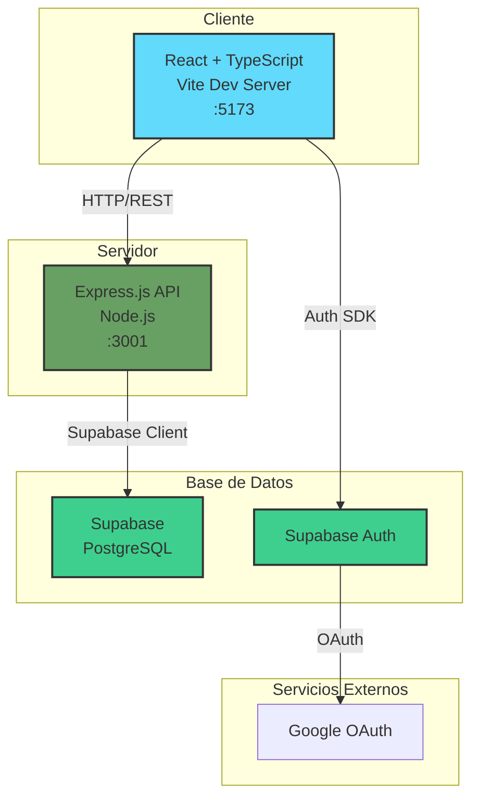
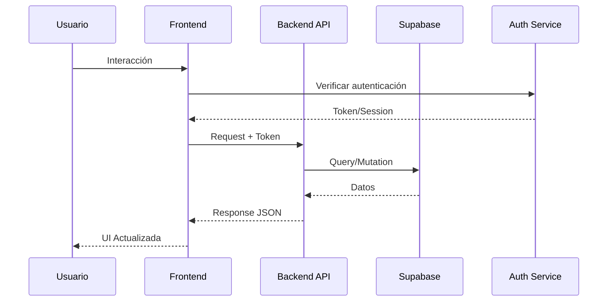
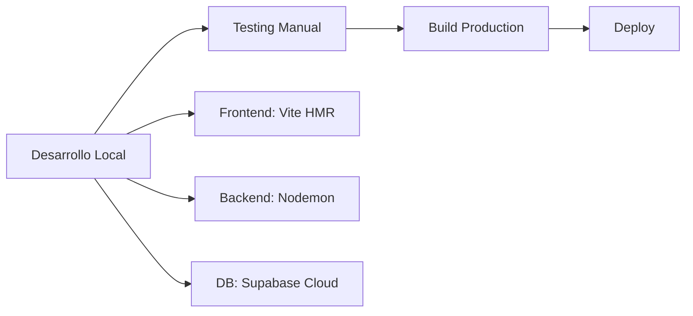

# 🏗️ Arquitectura del Sistema - Fitness App

## 📋 Resumen General

Sistema web full-stack para gestión de negocios fitness, construido con arquitectura cliente-servidor moderna y base de datos en la nube.

## 🎯 Diagrama de Arquitectura



## 🔧 Stack Tecnológico

### Frontend
- **Framework**: React 19.1.0 con TypeScript 5.8.3
- **Build Tool**: Vite 6.3.5
- **UI Library**: Material-UI v7
- **Routing**: React Router DOM 7.6.2
- **Estado**: React Hooks (useState, useEffect)
- **Charts**: ApexCharts

### Backend
- **Runtime**: Node.js
- **Framework**: Express.js 5.1.0
- **Base de Datos**: PostgreSQL (via Supabase)
- **ORM**: Supabase JavaScript Client
- **CORS**: Habilitado para desarrollo

### Infraestructura
- **BaaS**: Supabase (Database + Auth)
- **Base de Datos**: PostgreSQL gestionado por Supabase
- **Autenticación**: Supabase Auth + OAuth providers

## 📊 Flujo de Datos



## 🔐 Arquitectura de Seguridad

### Autenticación
1. **Email/Password**: Registro y login tradicional
3. **Sesiones**: Manejadas por Supabase Auth
4. **Tokens**: JWT automáticos por Supabase

### Autorización
- Rutas protegidas en frontend
- Verificación de sesión en cada request
- RLS (Row Level Security) disponible en Supabase

## 📁 Estructura de Carpetas

```
RepoEjemplo/
├── frontend/               # SPA React
│   ├── src/
│   │   ├── components/    # Componentes reutilizables
│   │   ├── pages/        # Vistas/Rutas
│   │   ├── services/     # Llamadas API
│   │   ├── layouts/      # Layouts de página
│   │   └── lib/          # Configuraciones (Supabase)
│   └── public/           # Assets estáticos
│
├── backend/              # API REST
│   ├── routes/          # Endpoints por entidad
│   ├── database/        # Conexión y esquema
│   └── index.js         # Servidor Express
│
└── docs/                # Documentación
```

## 🔄 Patrones de Diseño

### Frontend
- **Component-Based**: Componentes React modulares
- **Container/Presentational**: Separación lógica/UI
- **Service Layer**: Abstracción de llamadas API
- **Custom Hooks**: Lógica reutilizable

### Backend
- **RESTful API**: Verbos HTTP estándar
- **Route Handlers**: Un archivo por entidad
- **Async/Await**: Manejo moderno de promesas
- **Error Handling**: Try-catch consistente

## 🚀 Flujo de Desarrollo



## 💡 Decisiones Clave

1. **Supabase vs Backend propio**
   - ✅ Rapidez de desarrollo
   - ✅ Auth incluido
   - ✅ Escalabilidad automática

2. **Material-UI vs CSS propio**
   - ✅ Componentes probados
   - ✅ Diseño consistente
   - ✅ Responsive por defecto

3. **TypeScript**
   - ✅ Type safety
   - ✅ Mejor DX
   - ✅ Menos bugs en runtime