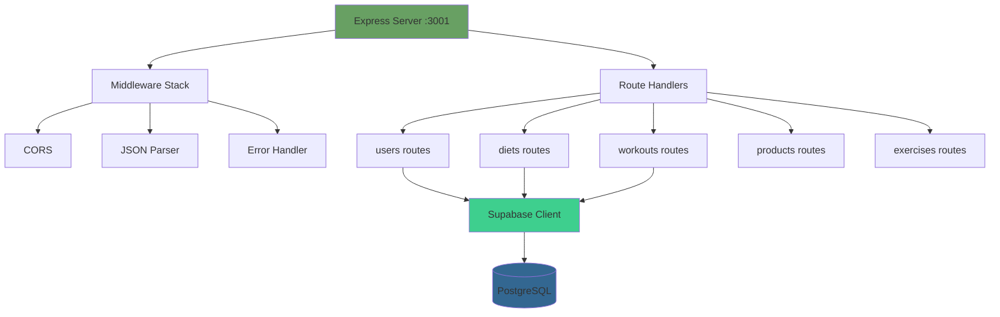
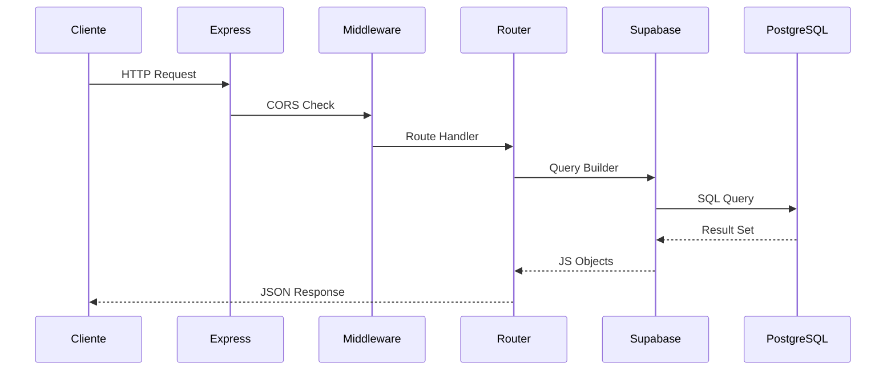
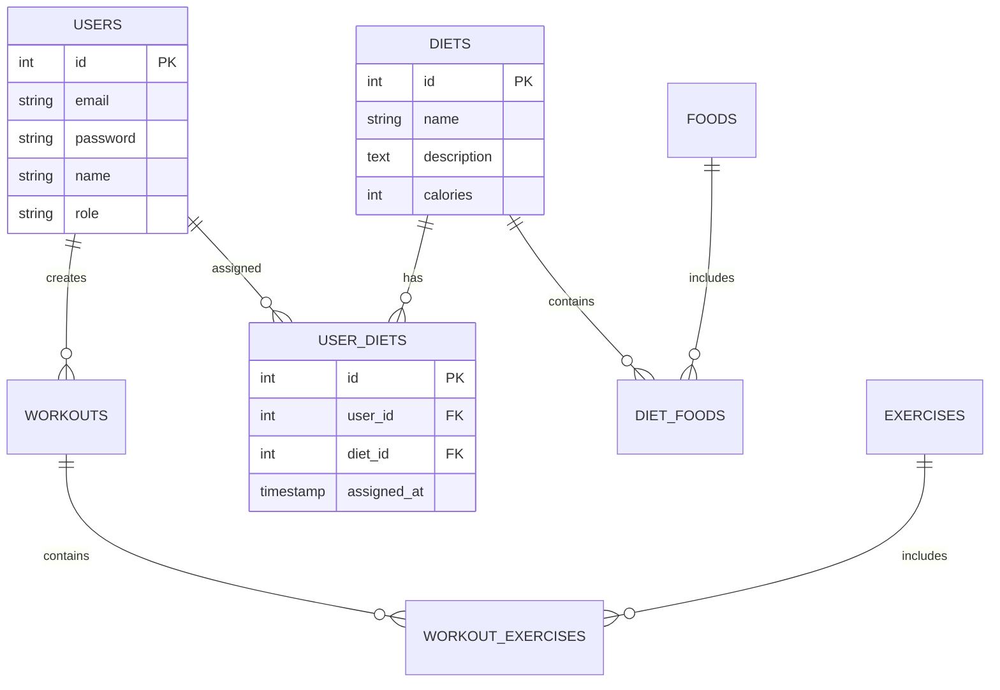

# ⚙️ Arquitectura Backend - Fitness Management Pro

## 📋 Resumen

API REST construida con Node.js y Express.js, conectada a PostgreSQL mediante Supabase Client, siguiendo principios RESTful.

## 🏗️ Estructura del Servidor



## 📁 Organización del Código

```
backend/
├── index.js              # Entry point + Express config
├── package.json          # Dependencies
│
├── database/
│   ├── supabaseClient.js # Conexión a Supabase
│   └── schema.sql        # Definición de tablas
│
└── routes/
    ├── users.js          # CRUD usuarios
    ├── diets.js          # CRUD dietas + relaciones
    ├── workouts.js       # CRUD rutinas
    ├── exercises.js      # CRUD ejercicios
    ├── products.js       # CRUD productos
    └── workouts_exercises.js  # Relaciones M:N
```

## 🔄 Flujo de Request



## 🗄️ Modelo de Datos



## 🛣️ Estructura de Rutas

### Patrón RESTful
```javascript
// GET    /api/resource     - Listar todos
// GET    /api/resource/:id - Obtener uno
// POST   /api/resource     - Crear nuevo
// PUT    /api/resource/:id - Actualizar
// DELETE /api/resource/:id - Eliminar

// Rutas anidadas para relaciones
// GET    /api/diets/:id/users    - Usuarios de una dieta
// POST   /api/diets/:id/users/:userId - Asignar usuario
```

### Ejemplo de Router
```javascript
// routes/diets.js
router.get('/', async (req, res) => {
  try {
    const { data, error } = await supabase
      .from('diets')
      .select('*')
      .order('id');
    
    if (error) throw error;
    res.json(data);
  } catch (error) {
    res.status(500).json({ error: 'Error al obtener dietas' });
  }
});
```

## 🔧 Middleware Stack

```javascript
// index.js
app.use(cors());                    // Cross-Origin
app.use(express.json());            // Body parser
app.use('/api/users', userRoutes);  // Route mounting
app.use(errorHandler);              // Error handling
```

## 🔐 Seguridad Actual

### Implementado
- CORS configurado para desarrollo
- Validación básica de inputs
- Manejo de errores consistente
- SQL injection protegido (Supabase)

### Pendiente
- Autenticación en endpoints
- Rate limiting
- Validación con Joi/Zod
- Helmet.js para headers

## 📊 Manejo de Datos

### Consultas Complejas
```javascript
// Obtener usuarios de una dieta con join
const { data } = await supabase
  .from('user_diets')
  .select('user_id, users(id, name, email)')
  .eq('diet_id', id);
```

### Transacciones
```javascript
// Crear dieta y asignar alimentos
const { data: diet } = await supabase
  .from('diets')
  .insert([dietData])
  .select()
  .single();

const foodRelations = foods.map(f => ({
  diet_id: diet.id,
  food_id: f.id,
  quantity: f.quantity
}));

await supabase
  .from('diet_foods')
  .insert(foodRelations);
```

## 🚦 Códigos de Estado

```javascript
200 OK          // GET exitoso
201 Created     // POST exitoso
204 No Content  // DELETE exitoso
400 Bad Request // Validación fallida
404 Not Found   // Recurso no existe
500 Server Error // Error interno
```

## 📈 Monitoreo y Logs

### Actual
```javascript
console.log(`Servidor corriendo en puerto ${PORT}`);
console.error('Error:', error);
```


## 🔌 Integración con Supabase

### Cliente
```javascript
const { createClient } = require('@supabase/supabase-js');
const supabase = createClient(SUPABASE_URL, SUPABASE_KEY);
```

### Ventajas
- Connection pooling automático
- Retry logic incluido
- Type safety con TypeScript
- RLS (Row Level Security) ready

## 💡 Decisiones Arquitectónicas

### ✅ Express.js Minimalista
- Framework ligero y flexible
- Gran ecosistema
- Fácil de entender

### ✅ Supabase Client vs ORM
- Menos boilerplate que Prisma/Sequelize
- Integración perfecta con Supabase
- Queries más directas

### ✅ Estructura por Recursos
- Un archivo por entidad
- Fácil navegación
- Separación clara
