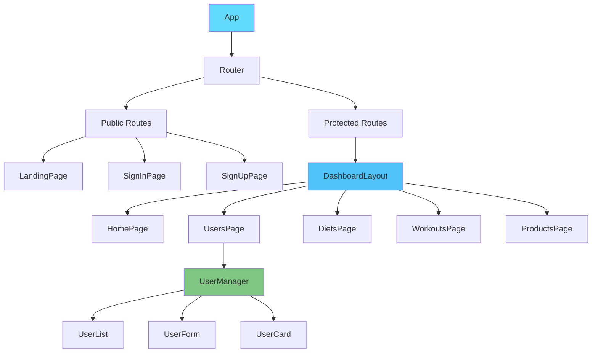
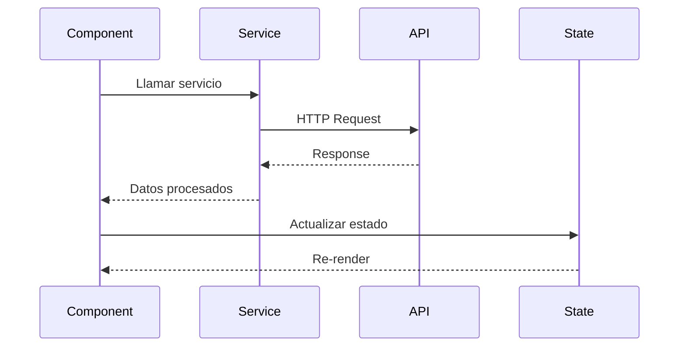
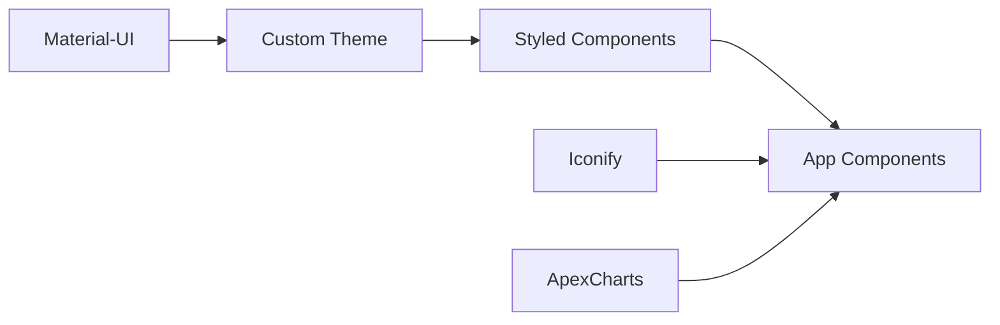
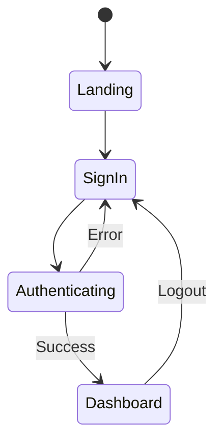

# 🎨 Arquitectura Frontend - Fitness Management Pro

## 📋 Resumen

Single Page Application (SPA) construida con React, TypeScript y Material-UI, optimizada para gestión de negocios fitness.

## 🏗️ Estructura de Componentes



## 📁 Organización de Carpetas

```
frontend/src/
├── components/           # Componentes reutilizables
│   ├── User/
│   │   ├── UserCard.tsx
│   │   ├── UserForm.tsx
│   │   ├── UserList.tsx
│   │   └── UserManager.tsx
│   ├── Diet/
│   ├── Product/
│   └── Workout/
│
├── pages/               # Vistas/Rutas principales
│   ├── HomePage.tsx
│   ├── SignInPage.tsx
│   ├── LandingPage.tsx
│   └── [Entity]Page.tsx
│
├── services/            # Capa de servicios API
│   ├── userService.ts
│   ├── dietService.ts
│   └── api.ts
│
├── layouts/             # Layouts de aplicación
│   ├── dashboard/
│   └── auth/
│
├── lib/                 # Configuraciones externas
│   └── supabase.ts
│
├── types/               # TypeScript types/interfaces
│   ├── User.ts
│   ├── Diet.ts
│   └── index.ts
│
└── utils/               # Utilidades y hooks
    ├── hooks/
    ├── notifications.tsx
    └── iconify.tsx
```

## 🔄 Flujo de Datos



## 🧩 Patrones de Componentes

### 1. Manager Pattern
```typescript
// UserManager maneja toda la lógica
const UserManager = () => {
  const [users, setUsers] = useState([]);
  const [editingUser, setEditingUser] = useState(null);
  
  // Lógica centralizada
  const handleCreate = () => {...}
  const handleEdit = () => {...}
  const handleDelete = () => {...}
  
  return (
    <>
      <UserForm onSubmit={handleCreate} />
      <UserList 
        users={users}
        onEdit={handleEdit}
        onDelete={handleDelete}
      />
    </>
  );
};
```

### 2. Service Layer Pattern
```typescript
// userService.ts
export const getUsers = async (): Promise<User[]> => {
  const response = await fetch(`${API_URL}/users`);
  return response.json();
};

// Component
const loadUsers = async () => {
  const data = await userService.getUsers();
  setUsers(data);
};
```

### 3. Custom Hooks
```typescript
// useToast.tsx
export const useToast = () => {
  const [open, setOpen] = useState(false);
  const showToast = (message: string) => {...};
  return { showToast, ToastContainer };
};
```

## 🎨 Sistema de Diseño

### Tema Material-UI
- **Primary Color**: Purple gradient (#667eea → #764ba2)
- **Typography**: DM Sans + Barlow
- **Spacing**: 8px grid system
- **Breakpoints**: xs, sm, md, lg, xl

### Componentes Base


## 🚦 Enrutamiento

```typescript
// Estructura de rutas
const router = createBrowserRouter([
  // Públicas
  { path: '/', element: <LandingPage /> },
  { path: '/sign-in', element: <SignInPage /> },
  
  // Protegidas
  {
    path: '/dashboard',
    element: <ProtectedRoute><DashboardLayout /></ProtectedRoute>,
    children: [
      { index: true, element: <HomePage /> },
      { path: 'users', element: <UsersPage /> }
    ]
  }
]);
```

## 🔐 Manejo de Estado

### Estado Local
- `useState` para UI y formularios
- `useEffect` para side effects
- `useCallback` para optimización

### Estado Global
- Context API para tema
- Supabase Auth para sesión
- Props drilling minimizado

## 📊 Flujo de Autenticación



## 📱 Responsive Design

### Breakpoints
- **Mobile**: < 600px
- **Tablet**: 600px - 960px
- **Desktop**: > 960px


## 💡 Decisiones Arquitectónicas

### ✅ TypeScript Strict Mode
- Prevención de errores en tiempo de compilación
- Mejor experiencia de desarrollo
- Refactoring más seguro

### ✅ Component-Based Architecture
- Reutilización máxima
- Testing aislado
- Mantenimiento simplificado

### ✅ Service Layer
- Separación de concerns
- API calls centralizadas
- Fácil mockeo para tests
