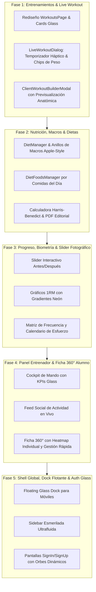

# Plan Director de Desarrollo por Fases: Experiencia UX/UI iOS 26 - Liquid Glass

**Proyecto**: Fitness App TFM / OpenGym Suite  
**Autoría**: Senior UX/UI Engineer & Lead Fullstack Architect  
**Paradigma Visual**: *iOS 26 - Liquid Glass* (Superficies de cristal translúcido esmerilado, refracción cáustica, bordes de luz especular, microinteracciones hápticas y biometría interactiva)  
**Fecha**: Septiembre 2026  
**Estado**: Especificación Técnica & Hoja de Ruta Aprobada para Ejecución

---

## 1. Manifiesto de Diseño: El Paradigma "iOS 26 Liquid Glass"

El objetivo del rediseño no es simplemente estético; se trata de una transformación ergonómica, cognitiva y sensorial que convierte el uso diario de la aplicación en una experiencia gratificante, fluida y adictiva.

```
       ┌────────────────────────────────────────────────────────┐
       │             ATMÓSFERA VISUAL LIQUID GLASS             │
       ├──────────────────────────┬─────────────────────────────┤
       │ Cristal Traslúcido        │ backdrop-filter: blur(28px) │
       │                          │ saturate(190%)              │
       ├──────────────────────────┼─────────────────────────────┤
       │ Iluminación Especular    │ Borde bicapa 1px con        │
       │                          │ gradiente angular blanco/luz│
       ├──────────────────────────┼─────────────────────────────┤
       │ Sombras Volumétricas     │ Difusión 32px con elevación │
       │                          │ de profundidad 0 16px 36px  │
       ├──────────────────────────┼─────────────────────────────┤
       │ Paleta de Neón Metabólico│ Cyan, Esmeralda, Ámbar,     │
       │                          │ Coral Hipertrofia, Violeta  │
       └──────────────────────────┴─────────────────────────────┘
```

### Principios Fundamentales del Sistema

1. **Jerarquía Espacial de Profundidad (Z-Index Lumínico)**:
   - **Capa Base (Fondo)**: Atmósfera oscura `#0b0f19` con sutiles orbes de luz dinámica (*mesh gradients*) que reaccionan a la navegación.
   - **Capa 1 (Paneles Contenedores)**: Superficies de cristal esmerilado con transparencia calculada (`rgba(15, 23, 42, 0.65)` en modo oscuro, `rgba(255, 255, 255, 0.75)` en modo claro).
   - **Capa 2 (Tarjetas de Acción & Widgets)**: Cristales con mayor índice de reflexión y bordes de luz acentuados.
   - **Capa 3 (Elementos Flotantes & Modales)**: Elevación con blur hiper-denso (`36px`) y sombras de contacto volumétricas.

2. **Cero Fricción Ergonómica**:
   - Todo elemento interactivo crucial para el entrenamiento (cambio de ejercicio, botón de inicio, añadir series, registrar peso) debe poder accionarse con una sola mano en pantalla de 6.1" a 6.7".
   - Áreas táctiles mínimas de **48x48px** con respuesta visual elástica (`transform: scale(0.97)`).

3. **Biometría en Tiempo Real**:
   - Los datos fisiológicos (series acumuladas por músculo, déficit/superávit calórico, 1RM, adherencia) no son tablas de texto frío: se representan mediante visualizadores orgánicos (el mapa corporal `BodyHeatmap`, anillos de macros dinámicos y velocímetros de recuperación).

---

## 2. Mapa Global de Fases de Desarrollo



---

## 3. Desglose Detallado de Fases y Especificaciones de Módulos

---

### 📱 FASE 1: Entrenamientos, Reproductor en Vivo y Creador de Rutinas

**Impacto UX**: Es el núcleo operativo de la app. Los usuarios interactúan con esta sección sudando en el gimnasio, con pulsaciones altas y poca paciencia para interfaces lentas o menús complejos.

#### 1.1 Catálogo y Lista de Entrenamientos (`WorkoutsPage.tsx`, `WorkoutManager.tsx`, `WorkoutList.tsx`, `WorkoutCard.tsx`)
- **Estado Actual**: Listado básico con tarjetas rectangulares y botones convencionales de texto.
- **Transformación Liquid Glass**:
  - **Glass Workout Cards**: Tarjetas con efecto refracción que muestran una imagen de fondo oscurecida con desenfoque de movimiento del ejercicio principal.
  - **Píldoras de Metadatos Neón**:
    - Grupo muscular primario (badge turquesa con icono anatómico).
    - Duración estimada (badge amarillo ámbar).
    - Dificultad (*Principiante, Intermedio, Avanzado* con indicador lumínico).
    - Intensidad RPE recomendada.
  - **Filtros Segmentados en Cápsula**: Barra flotante superior con categorías (*Hipertrofia, Fuerza Máxima, Full Body, Torso/Pierna, Empuje/Tirón/Pierna*) con deslizador de cristal que se mueve suavemente entre opciones.
  - **Quick Action "Iniciar Ahora"**: Botón primario con gradiente cian-esmeralda y micro-resplandor pulsante.

#### 1.2 Reproductor de Entrenamiento en Vivo (`LiveWorkoutDialog.tsx`)
- **Estado Actual**: Diálogo modal funcional con vídeo y tabla de series, pero con inputs estándar y sin retroalimentación háptica visual.
- **Transformación Liquid Glass**:
  - **Temporizador de Descanso Flotante (Glass Timer)**:
    - Widget circular translúcido que permanece visible aunque se haga scroll.
    - Círculo de progreso SVG con degradado que pasa de esmeralda a ámbar y parpadea en rojo/coral en los últimos 5 segundos con sonido/vibración.
    - Botones de ajuste instantáneo: `+15s`, `+30s`, `Skip`.
  - **Píldoras de Entrada Rápida de Carga**:
    - Al tocar el campo de peso o repeticiones, se despliega una barra háptica de botones rápidos: `+1 kg`, `+2.5 kg`, `+5 kg`, `+10 kg` y botón de duplicar serie anterior.
  - **Check de Serie con Animación de Brillo**:
    - Al marcar una serie como completada, la fila emite una onda de luz translúcida y cambia su borde a verde esmeralda neón.
  - **Pantalla de Resumen Final de Sesión (Post-Workout High)**:
    - Celebración con animación de partículas o confeti ligero.
    - Cálculo de **Volumen Total Levantado (Kg)**: comparado con un monumento o animal (ej: *"¡Has levantado 14.250 kg hoy, el equivalente a 3 elefantes!"*).
    - Indicador de Nuevos Récords Personales (**PRs**) conseguidos en la sesión.
    - Botón "Exportar Historia / Compartir" con diseño gráfico listo para redes sociales.

#### 1.3 Creador y Personalizador de Rutinas (`ClientWorkoutBuilderModal.tsx`)
- **Estado Actual**: Selector de ejercicios con búsqueda y lista.
- **Transformación Liquid Glass**:
  - **Mini Heatmap Anatómico en Vivo**: Panel lateral o superior colapsable que colorea en tiempo real qué músculos se van estimulando según se agregan ejercicios al planificador.
  - **Buscador con Infinite Scroll y Miniaturas Animadas**: Visualización instantánea de los 1.320 ejercicios con GIFs que se reproducen al posar el cursor o mantener pulsado.
  - **Filtro de Equipamiento**: Chips de selección rápida: *Mancuernas, Barra, Polea, Máquina, Peso Corporal, Bandas*.

---

### 🥗 FASE 2: Ecosistema Nutricional, Anillos de Macros y Planificador de Comidas

**Impacto UX**: La nutrición exige claridad absoluta. El usuario debe saber en 3 segundos cuántas calorías le quedan en el día y cómo va su reparto de macronutrientes.

#### 2.1 Dashboard de Dieta del Usuario (`ClientMyDietPage.tsx`, `DietManager.tsx`)
- **Estado Actual**: Tablas con listas de comidas e ingredientes en texto plano.
- **Transformación Liquid Glass**:
  - **Tríada de Anillos de Macros (Inspirados en Apple Health)**:
    - Anillo 1 (Exterior, Coral Neón): **Proteínas** (g alcanzados / objetivo).
    - Anillo 2 (Intermedio, Cian Neón): **Carbohidratos** (g alcanzados / objetivo).
    - Anillo 3 (Interior, Ámbar Neón): **Grasas Saludables** (g alcanzados / objetivo).
    - Centro del anillo: **Calorías Totales** con barra de balance energético (Superávit / Mantenimiento / Déficit).
  - **Tarjetas de Comidas Expandibles (Glass Accordion)**:
    - Pestañas con refracción para *Desayuno, Almuerzo, Comida, Merienda, Cena, Post-Entreno*.
    - Cada comida muestra: Hora sugerida, foto o icono ilustrativo, subtotales de macros y checklist para tachar alimentos consumidos.

#### 2.2 Gestor Interactivo de Alimentos (`DietFoodsManager.tsx`, `DietMealChecklist.tsx`)
- **Transformación Liquid Glass**:
  - **Barra de Búsqueda Flotante con Autocompletado**: Búsqueda sobre la base de datos de alimentos con cálculo en vivo según gramos introducidos.
  - **Intercambiador Inteligente de Alimentos**: Botón que permite sustituir un ingrediente por otro equivalente en macros (ej: 100g de arroz por 130g de patata o 90g de avena) manteniendo el plan intacto.

#### 2.3 Calculadora Metabólica y Exportador PDF (`CalorieCalculatorModal.tsx`, `DietVisualPdfModal.tsx`)
- **Transformación Liquid Glass**:
  - **Calculadora Metabólica con Sliders Táctiles**: Control deslizante con respuesta visual instantánea para peso, talla, % graso estimado, nivel de actividad física (NEAT + entrenos) y objetivo.
  - **Exportación PDF con Diseño Editorial de Revista**: Generación de documentos PDF limpios, modernos, con cabecera de cristal simulada, tipografía cuidada y código QR para sincronizar con la app móvil.

---

### 📈 FASE 3: Analítica de Progreso, Biometría y Slider Antes/Después

**Impacto UX**: Esta sección proporciona la mayor inyección de motivación psicológica para el alumno, demostrándole visual y numéricamente que su esfuerzo da resultados.

#### 3.1 Slider Fotográfico Interactivo "Antes y Después" (`ClientProgressSubmitPage.tsx`, `ProgressPhotosManager.tsx`)
- **Estado Actual**: Cuadrícula de fotos subidas en diferentes fechas.
- **Transformación Liquid Glass**:
  - **Componente Split-View Slider**:
    - El usuario selecciona dos fechas (ej: *Semana 1 vs Semana 12*).
    - Una barra divisoria vertical de cristal translúcido permite arrastrar de izquierda a derecha para comparar milimétricamente el cambio físico en la misma postura (Frontal, Lateral, Espalda).
    - Selector de postura con pestañas táctiles y zoom con lupa interactiva.
  - **Módulo de Subida Rápida con Guías de Silueta**:
    - Al subir una foto nueva desde el móvil, se dibuja una silueta guía en pantalla para asegurar que el encuadre y la postura sean idénticos a las fotos anteriores.

#### 3.2 Gráficas de Rendimiento y Fuerza 1RM (`ProgressPage.tsx`, `ExerciseProgressChart.tsx`)
- **Transformación Liquid Glass**:
  - **Áreas con Relleno de Gradiente Neón**: Gráficas interactivas con curvas suavizadas (*monotone cubic spline*) con sombreado de brillo inferior.
  - **Tooltips Flotantes Glass**: Al pasar el dedo o el cursor sobre un punto de la gráfica, aparece una píldora translúcida con la fecha, peso levantado, repeticiones logradas y 1RM calculado según la fórmula Brzycki:
    $$\text{1RM} = \frac{\text{Peso}}{1.0278 - (0.0278 \times \text{Reps})}$$
  - **Selector de Ejercicios Clave**: Selector de píldoras (*Press de Banca, Sentadilla, Peso Muerto, Dominadas, Press Militar, Remo con Barra*).

#### 3.3 Calendario de Consistencia (Activity Heatmap)
- Matriz de 52 semanas inspirada en las contribuciones de GitHub, pero adaptada al fitness: cada celda representa un día del año con coloración basada en la intensidad de las series completadas (Gris translúcido $\rightarrow$ Verde cian $\rightarrow$ Esmeralda intenso $\rightarrow$ Fuego coral).

---

### 👥 FASE 4: Cockpit del Entrenador, CRM y Ficha 360° del Alumno

**Impacto UX**: Para el entrenador, la plataforma debe ser su herramienta de trabajo más productiva: debe poder evaluar el estado de 50 alumnos en menos de 10 minutos y detectar quién necesita intervención inmediata.

#### 4.1 Dashboard Principal del Entrenador (`HomePage.tsx`, `CrmPage.tsx`)
- **Estado Actual**: Panel con métricas genéricas y enlaces.
- **Transformación Liquid Glass**:
  - **Hero Glass Cockpit**:
    - 4 Tarjetas Métricas Principales: *Alumnos Activos, Entrenamientos Completados Esta Semana, Tasa Media de Adherencia a la Dieta, Alumnos con Alerta de Inactividad (>5 días sin registrar datos)*.
  - **Feed de Actividad Social en Vivo (Activity Pulse)**:
    - Ticker vertical con scroll fluido que muestra eventos en tiempo real:
      - *"Carlos M. acaba de registrar un nuevo PR en Sentadilla (140 kg)"*
      - *"Laura G. completó su rutina Tirón Hipertrofia"*
      - *"Marcos P. subió su pesaje semanal (-650g)"*
  - **Buscador Global Inteligente con Tecla Rápida (`Cmd + K` / `Ctrl + K`)**:
    - Modal de cristal con búsqueda instantánea de alumnos, rutinas, alimentos y notas.

#### 4.2 Directorio de Clientes (`UsersPage.tsx`, `UserList.tsx`, `UserCard.tsx`)
- **Transformación Liquid Glass**:
  - **User Glass Cards con Anillo de Estado**:
    - Foto de perfil con anillo circular perimetral: Verde (al día), Ámbar (pesaje pendiente), Rojo (inactivo).
    - Métricas clave en la tarjeta: Peso actual, variación semanal ($\pm\text{kg}$), rutina asignada, última conexión.
    - Menú contextual rápido de tres puntos: *Asignar Rutina, Cambiar Dieta, Enviar Mensaje, Ver Ficha Completa*.

#### 4.3 Ficha 360° del Alumno (`UserDetailPage.tsx`, `UserDetailManager.tsx`)
- **Transformación Liquid Glass**:
  - **Navegación por Pestañas Esmeriladas**:
    1. **Resumen & Biometría**: Mapa corporal `BodyHeatmap` personalizado del alumno que muestra su volumen semanal y balance muscular.
    2. **Rutina Asignada**: Editor inline donde el entrenador puede modificar pesos y series directamente con guardado automático.
    3. **Plan Nutricional**: Estado de la dieta asignada y grado de cumplimiento semanal.
    4. **Historial de Pesajes & Fotos**: Galería fotográfica cronológica con slider antes/después integrado.
    5. **Ficha Médica & Lesiones**: Alergias, lesiones activas y notas confidenciales del entrenador con etiquetas de advertencia en color coral.

---

### 💎 FASE 5: Arquitectura Global del Layout, Dock Flotante Móvil y Auth Glass

**Impacto UX**: Proporciona coherencia y empaque de producto prémium a toda la experiencia, unificando la navegación tanto en pantallas de escritorio como en smartphones.

#### 5.1 Barra de Navegación y Floating Dock Móvil (`layout.tsx`, `Sidebar.tsx`)
- **Transformación Liquid Glass**:
  - **Floating Glass Dock (Modo Móvil)**:
    - Barra inferior flotante a 16px del borde inferior de la pantalla.
    - Forma de cápsula ergonómica con esquinas redondeadas (`border-radius: 28px`), fondo con cristal líquido ultra-denso y borde especular.
    - 5 Accesos directos principales: *Inicio, Rutinas, Nutrición, Progreso, Perfil*.
    - Indicador luminoso que viaja suavemente bajo el icono activo.
  - **Sidebar Esmerilada (Modo Desktop)**:
    - Barra lateral translúcida con transición suave al colapsar o expandir.
    - Secciones diferenciadas para Alumno y Entrenador con badges numéricos de notificaciones pendientes.

#### 5.2 Experiencia de Autenticación de Vanguardia (`SignInPage.tsx`, `SignUpPage.tsx`)
- **Transformación Liquid Glass**:
  - **Fondo con Malla de Luz Fluida**: Esferas de color cian y magenta que oscilan suavemente en segundo plano con desenfoque de 100px.
  - **Caja de Acceso Glassmorphic**: Contenedor central con bisel de luz y campos de texto con iconos integrados y validación háptica en vivo.
  - **Selector de Rol con Interruptor Segmentado**: Píldora deslizante para alternar entre *Soy Alumno* y *Soy Entrenador / Gimnasio*.

---

## 4. Matriz Técnica de Ejecución y Tareas por Fase

| Fase | Archivos de Frontend a Modificar / Crear | Endpoints de Backend Involucrados | Criterios de Aceptación Técnicos |
| :--- | :--- | :--- | :--- |
| **Fase 1: Entrenamientos & Live** | - `WorkoutsPage.tsx`<br>- `WorkoutManager.tsx`<br>- `WorkoutList.tsx`<br>- `WorkoutCard.tsx`<br>- `LiveWorkoutDialog.tsx`<br>- `ClientWorkoutBuilderModal.tsx` | - `GET /workouts`<br>- `GET /workouts/with-exercises`<br>- `POST /workout-sessions`<br>- `GET /exercises/search` | - 100% ejercicios con GIFs funcionando.<br>- Temporizador circular flotante visible en scroll.<br>- Selector háptico de peso (+1kg, +2.5kg).<br>- Resumen post-sesión con volumen total y PRs. |
| **Fase 2: Nutrición & Dietas** | - `DietsPage.tsx`<br>- `ClientMyDietPage.tsx`<br>- `DietManager.tsx`<br>- `DietFoodsManager.tsx`<br>- `DietMealChecklist.tsx`<br>- `DietVisualPdfModal.tsx` | - `GET /diets/user/:userId`<br>- `GET /diet-foods/diet/:id`<br>- `GET /foods`<br>- `POST /diets` | - Tríada de anillos de macros interactiva.<br>- Agrupación por comidas del día.<br>- Cálculo instantáneo de Kcal al editar gramajes.<br>- Exportación PDF estilizada. |
| **Fase 3: Progreso & Biometría** | - `ProgressPage.tsx`<br>- `ClientProgressSubmitPage.tsx`<br>- `ProgressPhotosManager.tsx`<br>- `ExerciseProgressChart.tsx`<br>- `WeeklyTrackingForm.tsx` | - `GET /client-progress-photos/user/:userId`<br>- `POST /weekly-tracking`<br>- `GET /weekly-tracking/user/:userId`<br>- `GET /analytics/prs/:userId` | - Slider Antes/Después táctil y arrastrable.<br>- Gráficas 1RM con curvas suaves y tooltips glass.<br>- Matriz de consistencia estilo heatmap anual. |
| **Fase 4: Entrenador & CRM** | - `HomePage.tsx`<br>- `CrmPage.tsx`<br>- `UsersPage.tsx`<br>- `UserList.tsx`<br>- `UserDetailPage.tsx`<br>- `UserDetailManager.tsx` | - `GET /users`<br>- `GET /users/:id`<br>- `GET /trainers/clients`<br>- `GET /activity-feed` | - 4 KPIs de cabina de mando con datos reales.<br>- Ticker de actividad en vivo.<br>- Ficha 360° con BodyHeatmap propio del alumno.<br>- Asignación ágil de rutinas y dietas. |
| **Fase 5: Shell & Auth** | - `layout.tsx`<br>- `Sidebar.tsx`<br>- `SignInPage.tsx`<br>- `SignUpPage.tsx`<br>- `liquid-glass.css` | - `POST /users/login`<br>- `POST /users/register`<br>- `GET /users/me` | - Floating Glass Dock en resoluciones móviles.<br>- Transiciones fluidas entre rutas.<br>- Formulario de login/registro con orbes dinámicos. |

---

## 5. Cronograma de Despliegue y Control de Calidad

1. **Protocolo de Verificación Continua**:
   - Cada fase se ejecuta mediante compilación estricta (`npm run build` en `frontend/`).
   - Verificación de ausencia de errores de consola y warnings de accesibilidad (`aria-hidden`, contrastes WCAG AA).
   - Comprobación de rendimiento de renderizado a 60 FPS en animaciones CSS y transformaciones SVG del mapa corporal.
2. **Estrategia de Versionado Git**:
   - Cada fase completada se consolida en un commit atómico documentado y sincronizado con el repositorio GitHub remoto (`origin/main`).

---

## 6. Próximo Paso Inmediato

Iniciar la **Fase 1 (Entrenamientos, Live Workout & Creador de Rutinas)**:
1. Modernización de `WorkoutsPage.tsx` y `WorkoutManager.tsx` con tarjetas Liquid Glass y filtros segmentados en cápsula.
2. Integración de temporizador de descanso háptico, selector de carga rápida y pantalla de resumen de récord personal (PR) en `LiveWorkoutDialog.tsx`.
3. Verificación de build y pruebas de interactividad.
